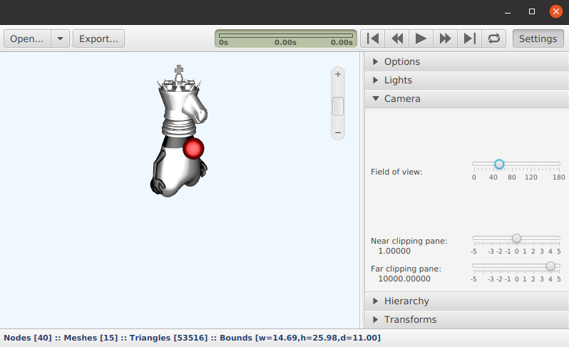
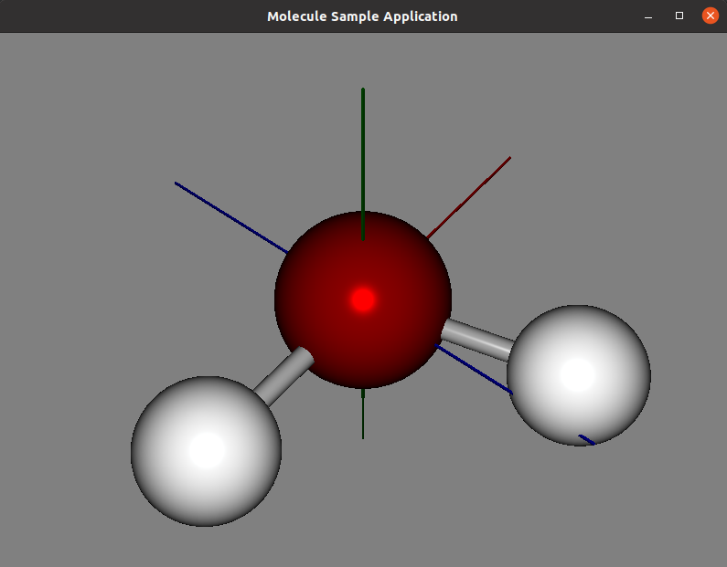

# JavaFX3D

JavaFX 3D experiments on Raspberry Pi.

## Projects

### 3DViewer

JavaFX application to load 3D drawings.

### Duke

3D drawings of Java Duke which can be used in the 3DViewer application.

### MoleculeSampleApp

JavaFX application which draws a water molecule

## Prerequisites

* Download the JavaFX JDK, e.g. https://gluonhq.com/download/javafx-16-ea-sdk-linux/
* Unpack to e.g. /home/{YOUR_NAME}/javafx-sdk-16/

## Run on Raspberry Pi

TODO
